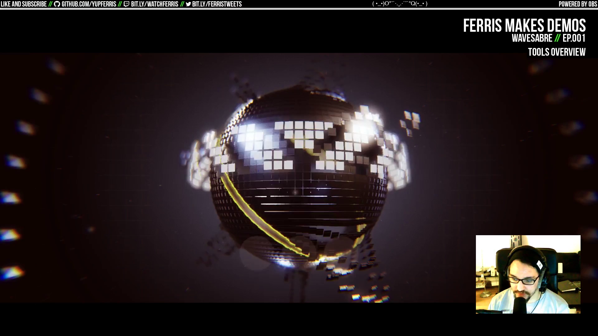
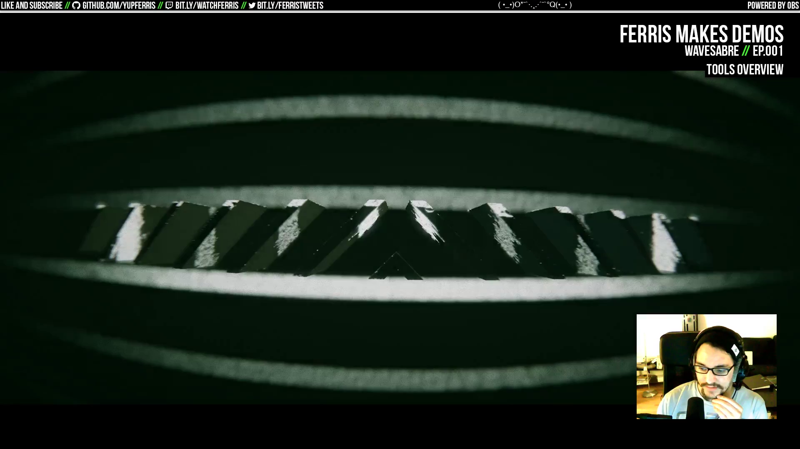
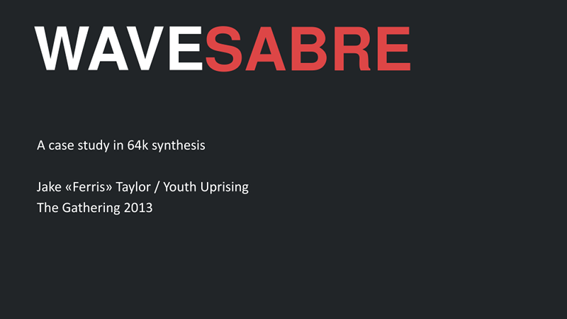
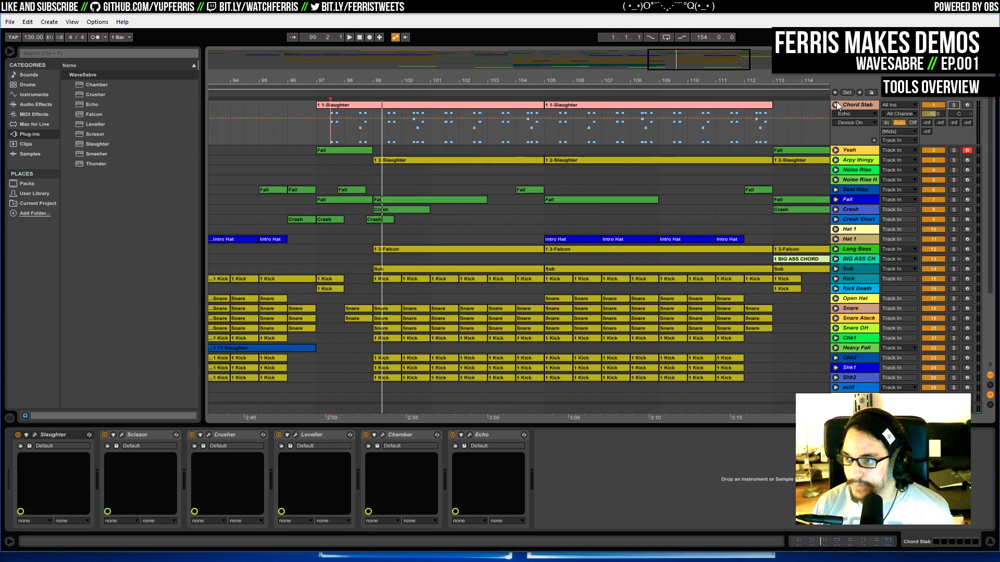
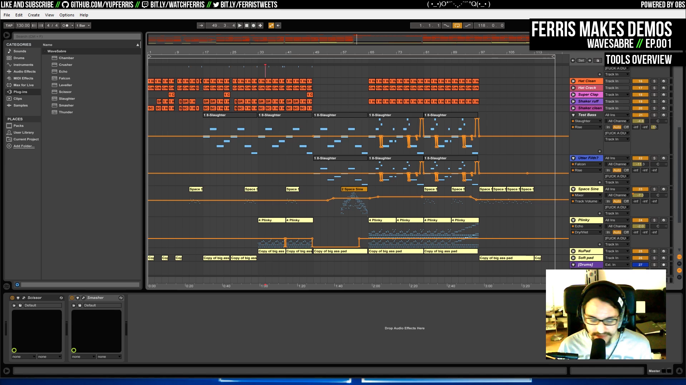

# Ep.001 - WaveSabre - Notes

Notes on [Ferris Makes Demos Ep.001 - WaveSabre][talk] by [ferris](https://github.com/yupferris).

*WaveSabre* is an audio synthesis tool to produce real-time music for 64k intros.

[talk]: https://www.youtube.com/watch?v=V8JXraZPkh8

`00:19:46` TODO track link

## Talk TOC

- `00:05:00` watch [Elysian][elysian-prod], track solely by [Hoffman][hoffman], whole intro is 56k, synth is ~30k compressed
- `00:08:00` mention Spaceballs [Makt][makt-prod] (Amiga demo) and [write-up][makt-article]
- `00:05:20` what is the demoscene? summary
- `00:13:15` watch *Migraine*, 44kb intro, made in ~5hrs
- `00:15:10` explain parts that make up a demo (audio and gfx)
- `00:16:15` executable music is a category of competition at demo parties
- `00:17:25` the work on the synth goes back to 5 years ago
- `00:18:15` byte-size of the music: depends... with this tool, ~20-22k
- `00:19:46` listen to the track, released at (?) TRSAC 2015, ~27k
- `00:24:45` demoscene history (cracktro origins)
- `00:26:10` the UI is [Ableton Live][ableton]
- `00:26:35` WaveSabre introduction
- `00:27:24` synth is written in C++
- `00:27:30` [slides about WaveSabre][wavesabre-slides] from 2013
- `00:27:45` `WaveSabreCore` -- envelopes, oscillators, devices, etc.
- `00:28:15` `WaveSabrePlayerLib` -- playing sound and executable, takes the serialized song and unpacks it to audio devices
- `00:28:25` `WaveSabreVstLib` -- connecting the libs to a coherent package
- `00:29:30` code overview
- `00:30:00` GUI overview (synth features rather than Ableton features)
- `00:31:40` slaughter, scissor, crusher, leveller, chamfer, echo
- `00:35:45` **crazy effect chains**
- `00:40:20` animated riser
- `00:41:30` samples (kick and snare)
- `00:43:00` Ableton project data format, gzipped XML
- `00:45:21` the life of a WaveSabre song (production -> conversion -> synth)
- `00:46:40` Vst plugins code (C++)
- `00:50:25` `WaveSabre` code code
- `00:54:45` `Crusher` device code
- `00:55:30` `SynthDevice` (plays notes, voices)
- `00:56:15` `WaveSabrePlayerLib` - `SongRenderer.cs`
- `00:57:10` `WaveSabreConvert` - `ProjectConverter.cs`
- `00:58:35` `WaveSabreConvert` - `Song.cs` data format description
- `00:59:05` `WaveSabreConvert` - `LiveProject.cs` destructuring the XML
- `00:59:35` `WaveSabreConvert` - `LiveConverter.cs` Ableton Live project structure to `Song` structure
- `00:59:50` `WaveSabreConvert` - `Serialize.cs` `Song` structure to binary blob
- `01:03:40` synth examples and breakdown
- `01:08:40` FM8 sound voicing
- `01:10:45` constant values
- `01:11:40` heavy synth can take up to 8% CPU
- `01:12:30` `FalconVoice` code
- `01:15:15` FM8 diagram
- `01:17:30` `Slaughter` device
- `01:18:45` **Elysian's track**
- `01:19:45` Ableton's mixers
- `01:21:30` track parts
- `01:28:30` exporting the finished track to a header file
- `01:30:40` Elysian track is 95k uncompressed

[elysian-prod]: http://www.pouet.net/prod.php?which=68375

[hoffman]: http://www.pouet.net/user.php?who=59635

[makt-article]: https://codingwithballs.wordpress.com/2017/02/19/makt/

[makt-prod]: http://www.pouet.net/prod.php?which=68878

[ableton]: https://www.ableton.com/en/live/

[wavesabre-slides]: http://iamferris.com/seminars/tg13/wsacs.pdf

## Screenshots

- `00:05:00` watch [Elysian][elysian-prod], track solely by [Hoffman][hoffman], whole intro is 56k, synth is ~30k compressed

- `00:13:15` watch *Migraine*, 44kb intro, made in ~5hrs

- `00:27:30` [slides about WaveSabre][wavesabre-slides] from 2013

- `00:35:45` crazy effect chains

- `01:18:45` Elysian's track

