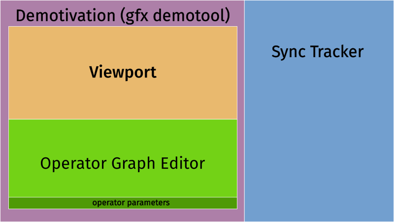
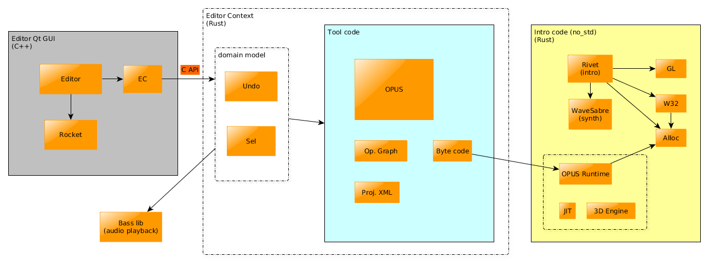

# Ep.002 - Demotivation - Notes

Notes on [Ferris Makes Demos Ep.002 - Demotivation][talk] by [ferris](https://github.com/yupferris).

*Demotivation* is the gfx demotool used by [Logicoma][LGC], created by *ferris*.

The tool generates the demo in real-time from an operator graph and renders it in the viewport.

Ferris says he took much inspiration for its design from the 4k tool of the [Loonies][loonies] group, which was created by [blueberry][blueberry].

The plan is that the tool will be (eventually) open-source as a public mirror, with demos being privately developed until released, at which point the tip of the repository will also get updated.

[talk]: https://www.youtube.com/watch?v=p9Obe-Xg35o

[LGC]: http://www.pouet.net/groups.php?which=12638

[loonies]: http://www.pouet.net/groups.php?which=442

[blueberry]: http://www.pouet.net/user.php?who=10883

<!-- markdown-toc start - Don't edit this section. Run M-x markdown-toc-generate-toc again -->
**Table of Contents**

- [Ep.002 - Demotivation - Notes](#ep002---demotivation---notes)
    - [Talk TOC](#talk-toc)
    - [Tool Windows Overview](#tool-windows-overview)
    - [App Tech and Layers](#app-tech-and-layers)
    - [Operator Graph Editor](#operator-graph-editor)
        - [Graph Colors and Concepts](#graph-colors-and-concepts)
        - [Operators](#operators)
        - [Graph execution and asset management](#graph-execution-and-asset-management)
    - [Sync Tracker](#sync-tracker)
    - [Sample Project](#sample-project)
        - [Rendering pipeline](#rendering-pipeline)
    - [Packaging the final EXE](#packaging-the-final-exe)
    - [Low-level module architecture](#low-level-module-architecture)

<!-- markdown-toc end -->

## Talk TOC

- `00:04:47` tool windows
- `00:07:00` demotivation tool
- `00:09:56` operator graph
- `00:11:00` JIT: needed to generate CPU code w/o Rust re-compiles
- `00:11:58` graph colors and concepts
- `00:17:00` variable scoping in the graph
- `00:26:25` app arch.: Rust, C++, Qt GUI layers via FFI
- `00:25:41` editing `vignetteStrength`
- `00:28:25` more on graph colors
- `00:35:55` show each part of the render pipeline
- `00:40:10` graph execution and asset management
- `00:43:50` rendering pipeline passes
- `00:49:45` DoF target buffer output
- `00:53:15` packaging the final EXE prod
- `01:01:55` slashing shape
- `01:04:00` undo - redo
- `01:05:55` low-level module architecture diagram
- `01:15:40` synth (WaveSabre)
- `01:17:25` UI layers, undo
- `01:21:50` input to Rivet and sync, binary blob exporting and packaging
- `01:26:15` platforms, final target is `x86` 32bit MSVC
- `01:28:15` less than 300k before compression
- `01:29:55` sync tracker variable values
- `01:33:15` content creation limitations for 64k
- `01:35:00` no texture generator in the tool
- `01:38:40` code overview
- `01:39:55` byte code of operators
- `01:43:30` JIT
- `01:50:00` x86 code instructions
- `01:52:45` main JIT module
- `01:54:15` ABI on Windows vs. OS/X
- `01:59:00` Op. code JIT translation
- `02:03:10` debugging JIT on OS/X
- `02:06:50` compile from graph ops enums
- `02:10:10` main compile fn from grid positions to AST
- `02:14:11` AST
- `02:16:20` compiler context
- `02:20:00` render target visitor
- `02:21:15` code gen visitor
- `02:21:50` expression parser with `nom` crate

## Tool Windows Overview

The screenshot shows a raymarched scene, its operator graph and a sync tracker window.

On left side is the demotool window, on the right side is the sync tracker window (separate application). The demotool connects to the sync tracker on a `localhost` port.




## App Tech and Layers

`00:26:25`

The tool (*Demotivation*) is written in Rust. This project produces a static library, which is interfaces with a thin GUI layer written in C++ using Qt using [FFI][FFI] (Foreign Function Interface).

```
Qt GUI (C++) <-> Application static library (Rust)
```

Qt is not used via Rust as a matter of convenience, it was easier to use it with C++.

[FFI]: https://en.wikipedia.org/wiki/Foreign_function_interface

## Operator Graph Editor

The operator graph describes the scene and the steps of the post-processing pipeline, and the general setup needed for these (defining viewport aspect, render targets, etc.).

The operators make up a visual programming language that will comprise the the CPU side of the code that is executed at every frame and renders the gfx in the viewport.

The operators are executed downwards one after the other until the next one is an empty block.

The blocks are a tree, represented with blocks on a grid.

As a **data model**, the graph is a hashmap of **positions** on a grid to **operators**. Operators are tagged enums. Each operator has an expression, a string which is later interpreted to values.

(`00:31:18`) An expession `sync("Post:black")` will grab a value from the sync tracker.

The graph is recompiled at every keypress and rendered, or errors are printed on the console.

It forms expressions like in an imperative programming language to drive OpenGL and a basic 3D engine.

Because of the frequent recompilation, it was necessary to generate the CPU code without re-compiling in Rust. Hence the [JIT][JIT] (just-in-time compilation) to `x86` instructions.

- the graph is compiled to a byte code (serialized binary blob)
- JIT compiles the byte code to x86 as a function that does all the drawing
- the x86 is executed for every frame to draw

`00:19:00`

- Q: why a visual language instead of a text-based one?
- A: less time spent on syntax, and easier to teach other group members how to use

[JIT]: https://en.wikipedia.org/wiki/Just-in-time_compilation

### Graph Colors and Concepts

`00:11:58`, `00:28:25`

**red** highlight is the master position (main entry point) where execution will start.

**blue** highlight is the cursor selection.

Execution starts on a block and steps downwards block-by-block, it stops when hitting an empty block.

Vertical arrangement: One vertical stack is one scope. 

Horizontal arrangement: for now it is only for visually grouping vertical stacks to organise functionality.

Scoping: A called subroutine has access to the variables of the caller. Argument ops (`ar`) compile-time check that callers have a certain local variable available when calling subroutines. This can ensure certain things to be there.

(`00:31:00`) Shaders are compiled, uniforms values are defined as float (`uf`) or render targets as texture inputs (`urtt`).

### Operators

| operator  | description                             |
|-----------|-----------------------------------------|
| `sb`      | define a subroutine                     |
| `cl`      | call a subroutine                       |
| `ar`      | argument for a subroutine               |
|           |                                         |
| `program` | bind a shader                           |
| `uf`      | uniform float                           |
| `urtt`    | uniform from render target as texture   |
|           |                                         |
| `clear`   | glClear                                 |
| `quad`    | draw on a quad                          |
| `vp`      | viewport settings                       |
|           |                                         |
| `rt`      | define render target                    |
| `rtb`     | bind render target before drawing on it |
|           |                                         |
| `lc`      | assign local variable                   |
| `gl`      | assign global variable                  |
|           |                                         |
| `if`      | conditional                             |
| `rp`      | repeat                                  |

### Graph execution and asset management

(`00:40:10`) Render targets have to be re-created every time the format is changed, or the view width or height changes, the JIT makes this very fast.

The whole graph is compiled to a function that is at called every frame, which does all the drawing.

The context for the function:

- storage for each of the variables
- stacks for maintaining GL state (pushing and popping)
- asset manager stores and updates render targets
- asset manager watches fragment shader files and reloads them from disk when they change

In the byte code this is turned into indexes in a big ordered list.

## Sync Tracker

Allows to move backwards and forwards in time, play and stop, etc.

This is based on GNU Rocket, although it doesn't have any code left from the original Rocket. The main part is a data format and protocol to do sync tracking via a [client-server IPC][IPC] (Inter-process Communication) model.

The editor is [emoon/rocket](https://github.com/emoon/rocket), created by [emoon][emoon] of *The Black Lotus* group.

[emoon]: http://www.pouet.net/user.php?who=861

[IPC]: https://en.wikipedia.org/wiki/Inter-process_communication

## Sample Project

This expresses the steps you would be hard-coding to produce the gfx.


- **1.**
- clear
- set aspect and viewport
- call `renderPipeline`
  - **2.**
  - call `initRender`
    - **3.**
    - setup render targets
  - call `gbufferPass`
    - set render target buffer
    - call `drawScene`
      - **4.**
      - draw raymarched scene to a g-buffer
  - call post-processing passes

### Rendering pipeline

`00:36:35` - `initRenderTargets`

`00:43:50`

- g-buffer pass
  - raymarching fills in a g-buffer
- depth of field pass
- bloom pass
- compositing pass
  - puts the output of the bloom and DoF together
- masking pass
  - such as the mirroring effect, logo fade, mirror mask
- chromatic aberration pass
  - RGB separation
- tone-mapping pass
  - vignette, exposure
- FXAA pass

`00:49:45` - show DoF target buffer output

`00:52:30` - output of compositing pass

## Packaging the final EXE

The tool has an `Export Project` menu which will write the data of the op. graph as a serialized byte code (binary blob).

A different project then uses that as an asset, simply takes the binary blob dump with the `include_bytes!` Rust macro).

This project will compile to the final EXE, so it can't use the standard library at all (has to be `no_std`).

`00:54:11` Showing the hex dump from the exporter (63kb). Shaders are not minified in this case.

The included byte code gets JIT-ed the asset manager will perpare render targets, compile shaders and so on, then the demo is played back.

## Low-level module architecture



`01:14:50`

OPUS from **Op**erator

Rivet will compile to the actual 64k intro prod EXE

- Opus takes the project (the list of operators) and serializes that to byte code
- Opus Runtime will take the byte code and turn it into `x86`
- the `x86` is then executed against the GL library

