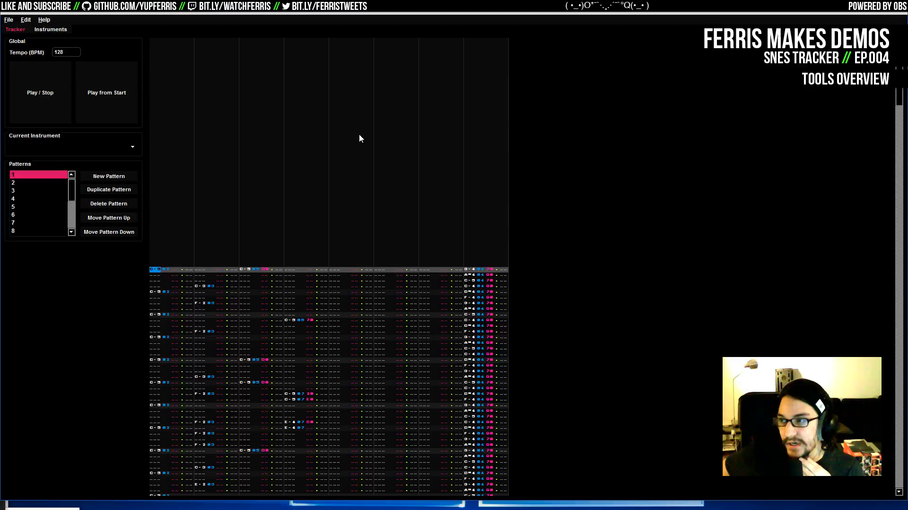
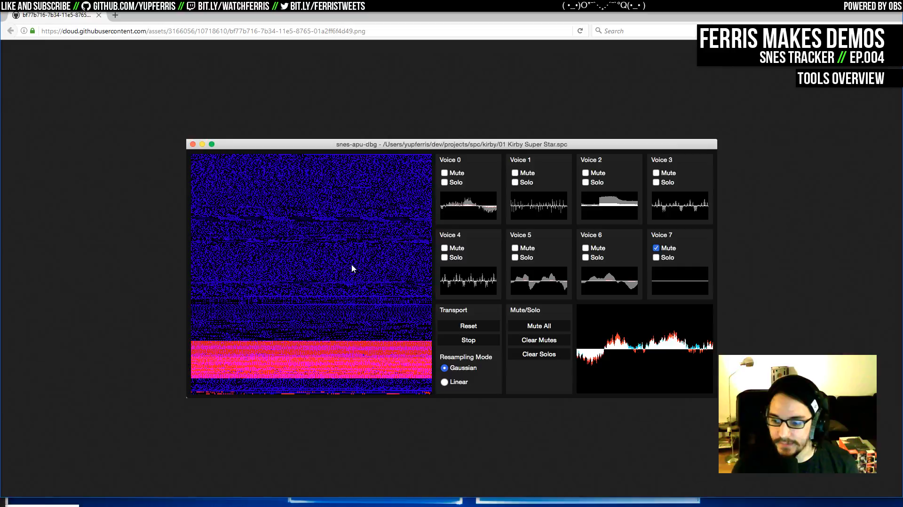
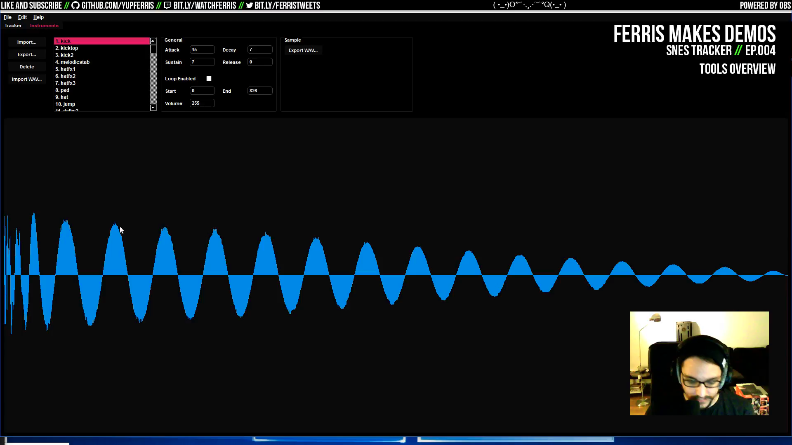

# Ep.004 - SNES Tracker - Notes

Notes on [Ferris Makes Demos Ep.004 - SNES Tracker][talk] by [ferris](https://github.com/yupferris).

Super Nintendo tracker for making music. The tool is work-in-progress, the plan is to release it as open source sometime in the future, once it is in a good shape.

Find demos made with this tool among the [Elix demos][elix], several prods by [cTrix][ctrix], also see [cTrix's YouTube channel][ctrix-youtube].

[talk]: https://www.youtube.com/watch?v=FNDZSbLdzrs

[elix]: http://www.pouet.net/groups.php?which=12309

[ctrix]: http://www.pouet.net/user.php?who=5786

[ctrix-youtube]: https://www.youtube.com/user/debuglive

## Talk TOC

- `00:02:05` work on the tool started in 2013, C++ and Qt
- `00:03:20` components: **the tracker** to compose music, which uses the emulator internally to play music as it is being played, and **the replayer** which plays back the exported code
- `00:05:10` [SPC][spc] is the Super Nintendo audio music format, which is a saved state from the audio unit
- `00:06:50` Super Nintendo music overview: the audio unit is a CPU, a DSP and 64k memory, this stores both the program code and the sample data
- `00:07:50` **debugging tool** with memory contents, blue: byte value, red: how recently the byte was accessed
- `00:10:05` the data is compressed with [BRR][brr] (bit-rate-reduction)
- `00:10:35` another tool like this: [SNES-GSS][snes-gss] tracker
- `00:11:50` tracker UI overview
- `00:12:00` **instrument tab**: an instrument is both the sample data and metadata (envelope params, loop, etc.)
- `00:14:40` **tracker tab**: 8 tracker columns for the different voices
- `00:16:25` **listen to a song** from the demo [nu][nu]
- `00:19:50` play the individual instruments
- `00:27:05` compression tricks: the audio samples are BRR, the audio track data is stored column-by-column
- `00:29:10` **listen to a song** from the demo [smash it][smash-it]
- `00:32:55` play the individual instruments
- `00:36:20` commands in the tracker UI
- `00:37:10` code overview
- `00:37:35` `ApuDriver` -- audio replayer, emits SPC 700 Assembler code
- `00:40:50` `CpuDriver` -- load the exported binary code to the audio unit and let it run
- `00:42:40` more `ApuDriver`
- `00:43:15` demonstrate code export from the tracker: ASM and BRR files

[spc]: https://en.wikipedia.org/wiki/Nintendo_S-SMP#Format

[brr]: https://en.wikipedia.org/wiki/Bit_Rate_Reduction

[snes-gss]: https://github.com/nathancassano/snesgss

[nu]: http://www.pouet.net/prod.php?which=62927

[smash-it]: http://www.pouet.net/prod.php?which=64255

## Screenshots

- `00:02:05` work on the tool started in 2013, C++ and Qt

- `00:07:50` **debugging tool** with memory contents, blue: byte value, red: how recently the byte was accessed

- `00:12:00` **instrument tab**: an instrument is both the sample data and metadata (envelope params, loop, etc.)

