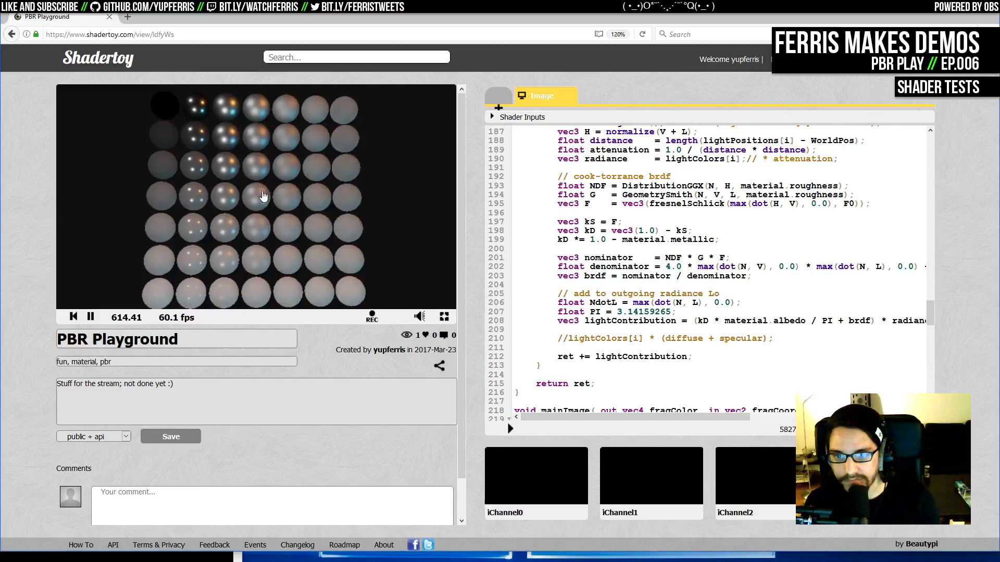
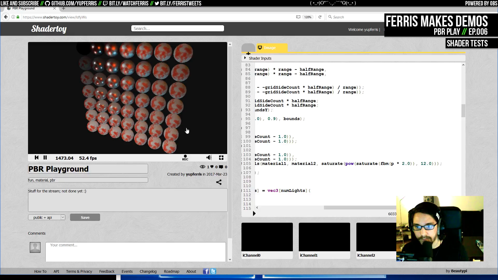
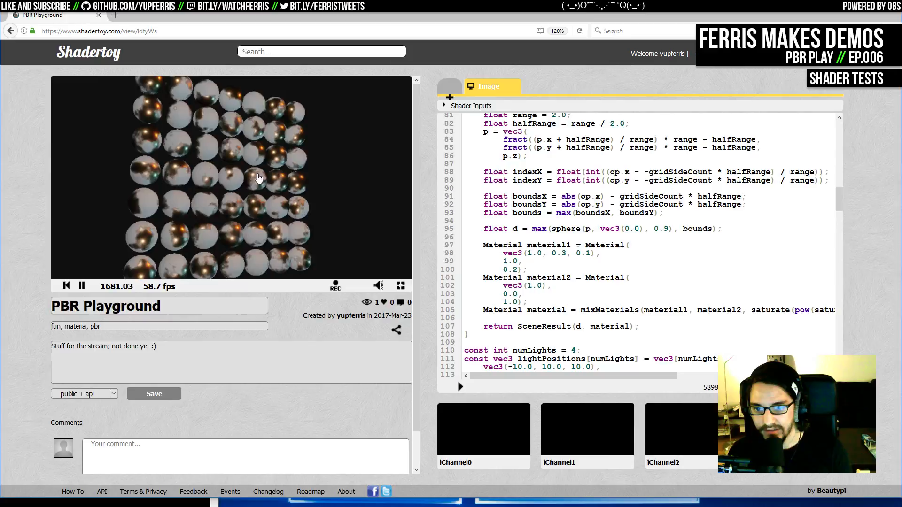
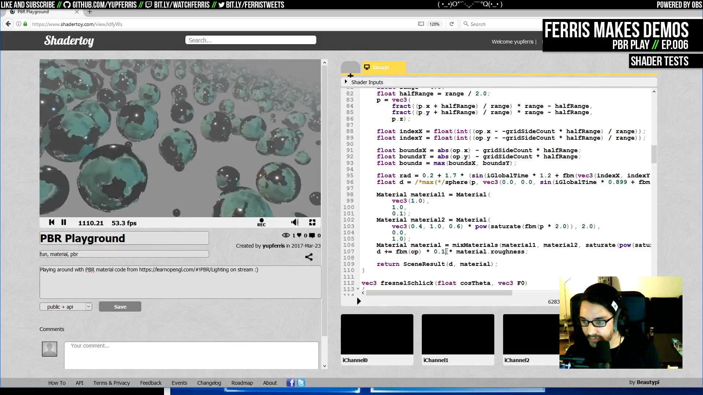
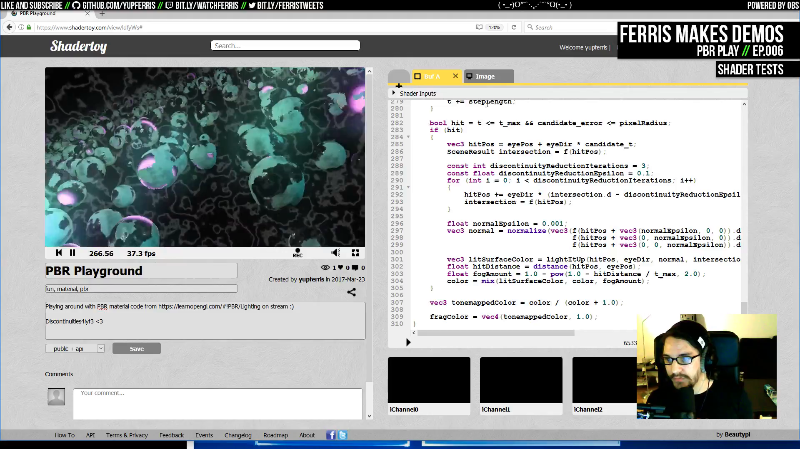
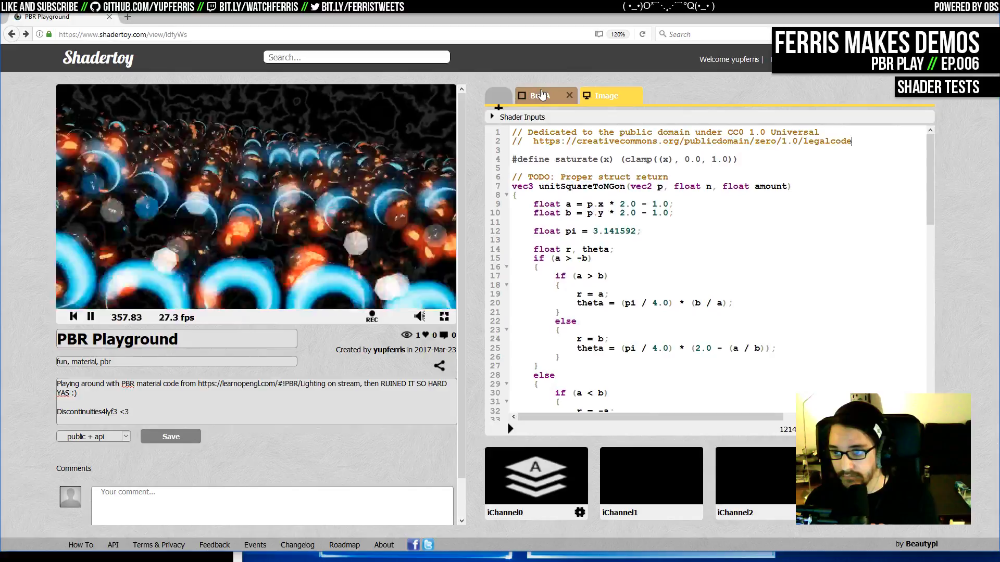

# Ep.006 - PBR Play - Notes

Notes on [Ferris Makes Demos Ep.006 - PBR Play][talk] by [ferris](https://github.com/yupferris).

Following the [PBR tutorial on learnopegl.com][pbr-learnopengl].

See the [shader on shadertoy][pbr-play-shadertoy].

Related PBR talks:

- [Revision 2012 - Introduction to light shading for real-time rendering](https://www.youtube.com/watch?v=Z23RWx2hvpA)
- [Revision 2015 - Seminar - Supraleiter And Its Physically-Based-Rendering Techniques](https://www.youtube.com/watch?v=HnePmLm-UWE)

Acronyms:

- PBR: [Physically based rendering](https://en.wikipedia.org/wiki/Physically_based_rendering)
- HDR: [High-dynamic-range rendering](https://en.wikipedia.org/wiki/High-dynamic-range_rendering)
- LDR: Low dynamic range rendering

[talk]: https://www.youtube.com/watch?v=LuKwU7BJv44

[pbr-play-shadertoy]: https://www.shadertoy.com/view/ldfyWs

[pbr-learnopengl]: https://learnopengl.com/#!PBR/Theory

## Talk TOC

- `00:05:45` this is a bog-standard sphere-tracer (the [enhanced version (Keinert, 2014)][enhanced-sphere]) with basic Phong lighting as a starting point TODO shot
- `00:09:15` [Phong lighting][phong] overview: ambient + diffuse + specular
- `00:11:00` vectors on a point of the object surface (normal, view, light direction, half-vector, reflection) TODO shot
- `00:13:20` specular component
- `00:16:40` overview of the sphere tracing method
- `00:22:40` `Material` struct: albedo, metallic, roughness
- `00:24:50` PBR lighting is a microfacet surface, energy conservation and physically-based BRDF (the reflection factor)
- `00:28:15` the BRDF tells you how much light is reflected at a given point (gives you a scalar float value to multiply colors with)
- `00:31:00` start changing the material for PBR
- `00:42:00` dark but more PBR
- `00:45:40` diffuse part
- `00:46:30` better colors with less attenuation
- `00:47:55` tonemapping and gamma correction
- `00:53:15` debugging the missing highlight from the corner spheres
- `00:58:25` makes sense that there isn't a highlight, with a roughness of 1 the light source would have to be perfectly aligned with the reflection vector
- `00:59:15` changing the albedo color, the highlights still preserve the color of the light sources
- `01:00:40` mixed material colors
- `01:04:15` mixed rough and shiny material
- `01:07:10` randomized variation in the material color
- `01:10:20` change light positions to move with time
- `01:11:50` animate sphere size and position
- `01:17:30` add some fog
- `01:24:20` working fog
- `01:27:40` perturb the distance function for wrinkled sphere surfaces
- `01:29:00` greenish mixed distorts
- `01:30:55` add an fbm background
- `01:35:10` working fbm background
- `01:35:40` add emissive value to the material
- `01:38:35` working emissive material
- `01:39:50` add a simple bloom pass
- `01:41:40` [gaussian kernel calculator][kernel-calc]
- `01:51:25` bloom before gamma correction
- `01:55:25` box pixels effect
- `01:58:00` red glow
- `02:01:55` ripple motion
- `02:09:25` bloom with bokeh
- `02:11:10` call it a day

[enhanced-sphere]: https://scholar.google.com/scholar?q=enhanced+sphere+tracing

[phong]: https://en.wikipedia.org/wiki/Phong_reflection_model

[kernel-calc]: http://dev.theomader.com/gaussian-kernel-calculator/

## Screenshots

- `00:46:30` better colors with less attenuation

- `01:00:40` mixed material colors

- `01:04:15` mixed rough and shiny material

- `01:29:00` greenish mixed distorts

- `01:51:25` bloom before gamma correction

- `02:09:25` bloom with bokeh

