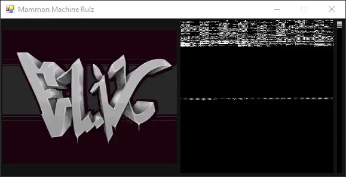
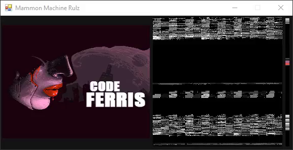
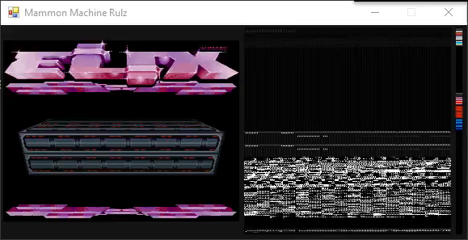
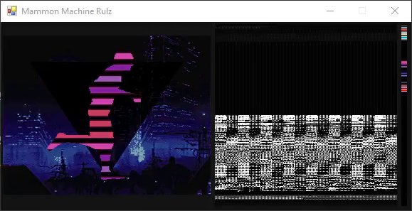
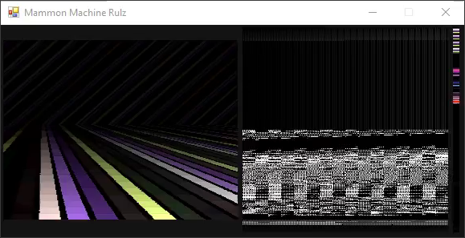
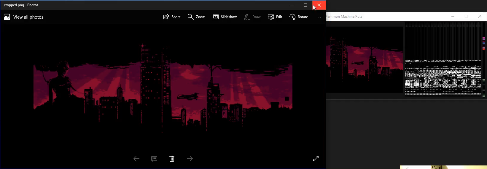
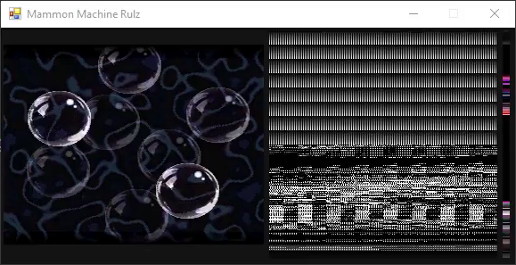
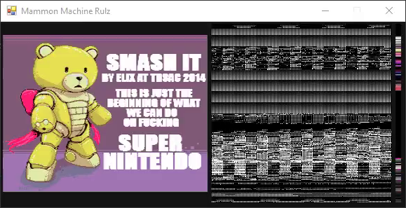
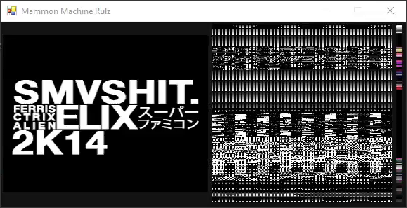
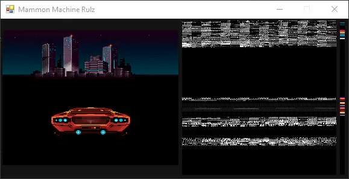

# Ep.007 - Smash It Breakdown - Notes

Notes on [Ferris Makes Demos Ep.007 - Smash It Breakdown][talk] by [ferris](https://github.com/yupferris).

Breakdown of the SNES demo [Smash It][smash-it] by [elix][elix], released at TRSAC 2014.

[elix]: http://www.pouet.net/groups.php?which=12309

[smash-it]: http://www.pouet.net/prod.php?which=64255

[talk]: https://www.youtube.com/watch?v=nWX-7vxwNug&t=16s

## Talk TOC

- `00:06:40` watch [Smash It][smash-it]
- `00:12:10` [Elix][elix] logo, 16 colors
- `00:19:25` LadyFace screen
- `00:28:00` text sprite fade-in
- `00:32:55` hue changes
- `00:34:10` XVectors effect with Mode7
- `00:37:10` [Mode7 Graphics Representation][mode7-gfx-rep]
- `00:40:50` properly starting to talk about XVectors effect
- `00:42:25` comment out `hdma` to disable the rotated effect on the boxes
- `00:52:00` box separation control
- `00:56:55` runner effect
- `00:57:50` background asset images
- `00:59:50` runner animation frame images
- `01:09:30` lines effect
- `01:14:40` scroller effect
- `01:17:35` bubbles effect
- `01:23:15` CareBear screen, bear is Gundam KUMA-03 Beargguy III
- `01:24:00` final screen
- `01:26:50` driver scene - bonus content, wasn't shown in the demo
- `01:29:15` bonus asset images

[mode7-gfx-rep]: https://emu-docs.org/Super%20NES/General/snesdoc.html

## Screenshots

- `00:12:10` [Elix][elix] logo, 16 colors

- `00:19:25` LadyFace screen

- `00:34:10` XVectors effect with Mode7

- `00:56:55` runner effect

- `01:09:30` lines effect

- `01:14:40` scroller effect

- `01:17:35` bubbles effect

- `01:23:15` CareBear screen, bear is Gundam KUMA-03 Beargguy III

- `01:24:00` final screen

- `01:26:50` driver scene - bonus content, wasn't shown in the demo

