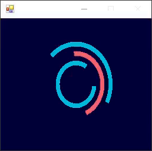
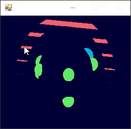
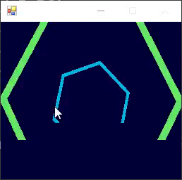
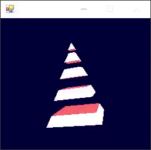
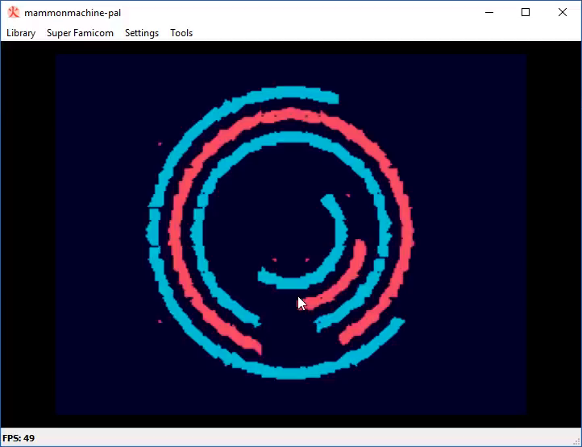

# Ep.008 - Nu Breakdown - Notes

Notes on [Ferris Makes Demos Ep.008 - Nu Breakdown][talk] by [ferris](https://github.com/yupferris).

Breakdown of the SNES demo [nu] by [ferris][ferris-pouet], released at The Gathering 2014.

[nu]: http://www.pouet.net/prod.php?which=62927

[ferris-pouet]: http://www.pouet.net/user.php?who=16820

[elix]: http://www.pouet.net/groups.php?which=12309

[talk]: https://www.youtube.com/watch?v=VyRdb8A8HWo

## Talk TOC

- `00:02:05` watch [nu]
- `00:04:20` production time ~2 weeks in a mad rush
- `00:05:15` this is OpenGL that gets video compressed, then that video is played back on the Super Nintendo plus playing the audio made with a custom tracker
- `00:05:40` see the OpenGL demo, immediate-mode GL
- `00:06:30` demo math planning: in one `vblank`, if it is all `dma`, you can get 3kb data over in one frame
- `00:09:50` beeble's gfx in [four.color.process][four-color] was the inspiration for the design
- `00:12:10` parts of the OpenGL demo, the effects are mostly drawn on quads moving around and displayed from a camera perspective
- `00:12:35` rangs scene: color rings as arcs of a certain radius
- `00:18:00` globule scene
- `00:25:15` tunnel scene
- `00:28:05` pyramid scene: drawn with a function that draws a segment of a pyramid
- `00:37:00` change scene parameters: more rings, red globule
- `00:39:55` try to re-compress and tweak until it succeeds
- `00:47:00` **Scribbles** -- early demo tool prior to Mammon Machine
- `00:49:40` small scripting system for the tool
- `00:52:20` `AnimationSerializer`, `IVideoGenerator`
- `00:55:40` `VideoCompressor`
- `00:57:15` tile cache compression
- `01:04:50` result of high error tolerance in the tile caching
- `01:10:10` optimizer for VRAM and palette data

[four-color]: https://vimeo.com/46837620

## Screenshots

- `00:12:35` rangs scene: color rings as arcs of a certain radius

- `00:18:00` globule scene

- `00:25:15` tunnel scene

- `00:28:05` pyramid scene

- `01:04:50` result of high error tolerance in the tile caching

